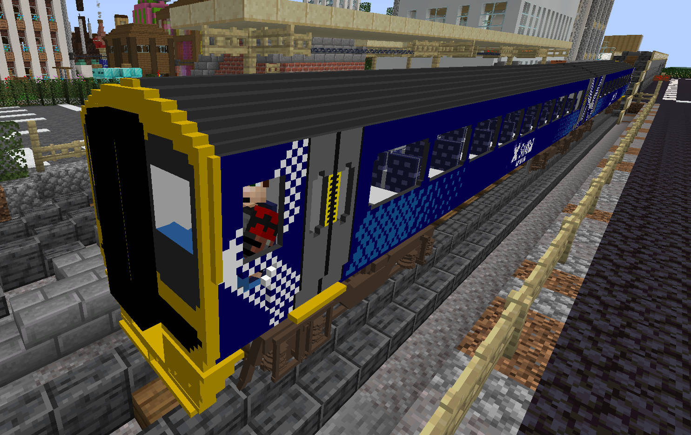
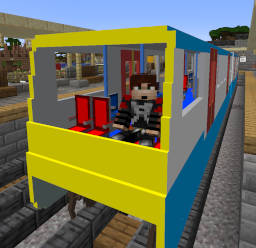
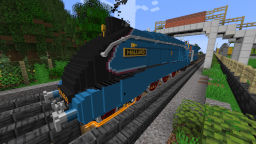

HoganFam Minecraft Train Pack
=============================

This project is to create some semi-realistic trains for use with Minecraft
Java Edition and the [TrainCarts Spigot plugin].



It consists of a resouce pack containing models and textures for various train
parts (which the Minecraft clients will need), and a saved train module to be
loaded on the server running the plugin to organise the models into trains.

- Matrix Chat Room: [\#mc-trains:hoganfam.uk](https://matrix.to/#/#mc-trains:hoganfam.uk?via=hoganfam.uk)


Features
--------

The aim is for trains to have the following features:
 - Realistic scale.
 - Fairly high amount of detail.
 - Separate bogies wherever possible so they turn to follow curves.
 - Skinnable liveries.
 - A detailed cab.
 - A reasonable amount of seating (except where the size of Steve does not
   allow).
 - A platform on which the player can move around inside the train while
   stationary and to exit onto a platform without jumping.


Trains
------

The following trains are provided:

Train ID    | Name                                      | Status        | Screenshot
------------|-------------------------------------------|---------------|------------
[class158]  | British Rail Class 158 Express Sprinter   | Beta          | 
[metro]     | Metro train inspired by B07 DLR train     | Beta          | 
[a4]        | LNER Class A4 (4468 Mallard)              | Beta          | 

[class158]: ./docs/class158.md
[metro]: ./docs/metro.md
[a4]: ./docs/a4.md

Detailed features for each train:

Train ID   | Front | External Skin | Cab | Seating | Bogies | External Details
-----------|-------|---------------|-----|---------|--------|------------------
[class158] | 80%   | 100%          | 70% |  70%    | 100%   |  50%
[metro]    | 80%   | 100%          |  0% | 100%    | 100%   | 100%
[a4]       | 90%   | 100%          | 20% | 100%    | 100%   |  90%


License 
-------

The `Makefile`, and all `.yml`, `.yml.in` files in `srv/` are released under
the [GNU General Public License, version 2].
 - Copyright © 2022-2023 James Hogan <james@albanarts.com>

In order to make shulkers completely invisible (these are used for platforms on
which players can walk while a train is stationary):
 - `res/assets/minecraft/textures/entity/shulker/shulker.png` is included based
   on the version in Minecraft 1.18.2, but modified to make the head
   transparent.
 - `res/assets/minecraft/shaders/core/rendertype_entity_solid.fsh` is included
   from [MC-164001](https://bugs.mojang.com/browse/MC-164001) to fix shulker
   transparency since Minecraft 1.15.

Various other files in `res/` are from Minecraft:
 - `res/assets/minecraft/textures/item/gold_pickaxe.png`

All original files in `res/**/amalon/` are released under the [Creative Commons
Attribution-Share Alike 3.0 Unported] unless otherwise stated.
 - Copyright © 2022-2023 James Hogan <james@albanarts.com>


Download
--------

Official releases of the `hoganfam_trains.zip` resource pack and
`hoganfam_trains.yml` saved train module can be downloaded from the
[Releases](https://github.com/amalon/hoganfam-trains/releases/) page.

The `hoganfam_trains_lite.yml` saved train module can be used in place of
`hoganfam_trains.yml` to significantly reduce the number of entities. Trains in
the lite saved train module lack platforms that can be walked on while the
train is stopped.


Building from Source
--------------------

The included Makefile can be used to build both a `hoganfam_trains.zip`
resource pack and a `srv/hoganfam_trains.yml` saved train module from source:

```shell
$ make
```


Installing
----------

### The Resource Pack

Download or build the `hoganfam_trains.zip` resource pack as described above.

You may want to modify `hoganfam_trains.zip` or combine it with other resource
packs needed for your server.

You can put a resource pack on a webspace (it is recommended to rename it so it
has a version number to ensure clients download new versions), and set up your
Minecraft Java Edition server to point your players at it by setting the
following in your `server.properties` file:

```
resource-pack=https\://github.com/amalon/hoganfam-trains/releases/download/v23.09.a/hoganfam_trains_v2309a.zip
resource-pack-sha1=4dd7a7cda59cb52946c5a16f6118d90145dad886
```

The SHA1 hash can be found using `sha1sum`:

```shell
$ sha1sum hoganfam_trains_v2309a.zip
```

### The Saved Train Module

Download or build the `hoganfam_trains.yml` saved train module as described
above.

Copy `hoganfam_trains.yml` to `plugins/Train_Carts/savedTrainModules` on your
Minecraft Java Edition server.

Modules can be reloaded with the TrainCarts command:

```
/train globalconfig reload --savedtrainproperties
```


Spawning a train
----------------

You can then spawn a train using a [spawn
sign](https://wiki.traincarts.net/p/TrainCarts/Signs/Spawner) with a button
underneath placed under railway track, with the following text:
```
[train:left]
spawn 0.2
<trainname>
```

Where `<trainname>` is replaced with one of the provided train IDs (see Trains
above). This particular example launches the new train at 0.2 blocks/second to
the left.


Stations
--------

You can make a train stop at a station using a [station
sign](https://wiki.traincarts.net/p/TrainCarts/Signs/Station) placed under
railway track with the following text:
```
[+train]
station .8m/ss
18
continue
```

This particular example stops trains for 18 seconds, and launches trains in the
direction they were going (replace `continue` with `left` or `right` to make it
always launch in a particular direction), with an acceleration of 0.8 metres /
second<sup>2</sup>. See train information above for recommended values.

To activate the door animations, use an [animate
sign](https://wiki.traincarts.net/p/TrainCarts/Signs/Animate) placed under
railway track at each end of the stopped train so that it activates soon before
stopping, with the following text:
```
[+train:left]
animate reset
doors_r
1.0 2.0
```

This particular example activates for trains coming from the left of the sign
(so would be appropriate for the right end of the platform), and activates the
right side door open and close animation at 1.0x speed after a delay of 2.0
seconds.

You can tune the 2 second delay so that the doors open soon after stopping. See
train information above for recommended values.


[TrainCarts Spigot plugin]: https://www.spigotmc.org/resources/traincarts.39592/
[TC Coasters Spigot plugin]: https://www.spigotmc.org/resources/tc-coasters.59583/
[GNU General Public License, version 2]: https://www.gnu.org/licenses/old-licenses/gpl-2.0.html
[Creative Commons Attribution-Share Alike 3.0 Unported]: https://creativecommons.org/licenses/by-sa/3.0/
